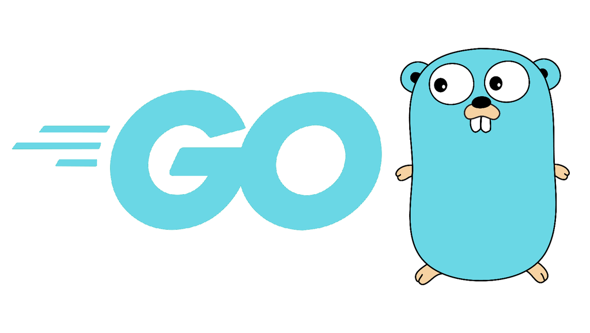
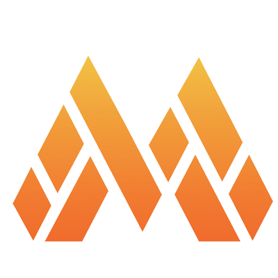
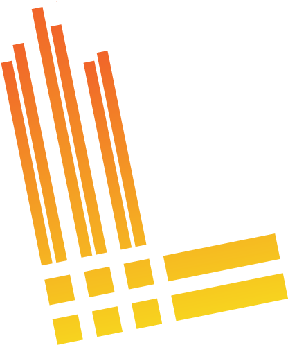
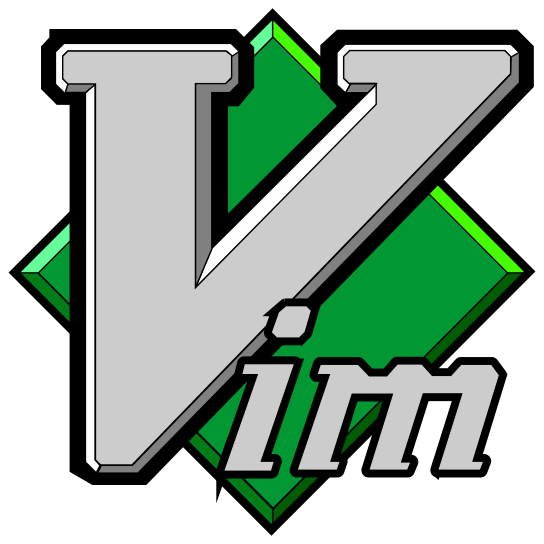

I am Théo a Platform Engineer at [Giant Swarm](https://www.giantswarm.io/), working with [Kubernetes](https://kubernetes.io/) in a multi-cloud multi-cluster environment. I have a strong experience around [Observability](https://opentelemetry.io/docs/concepts/observability-primer/) and mainly coding with [Golang](https://go.dev/).

I am open minded, a team player and a fast learner who likes to solve complex tasks. Open source, cloud computing, DevOps and automation are my daily drivers. btw I use [Arch](https://wiki.archlinux.org/title/Arch_Linux).

We can also talk about: Snowboarding, Cycling, Chess, Travelling, Cooking, Movies, Music

	
	
	
	
	
	
	
	
	
	
	
	
	
	
	
	
	
	

	

